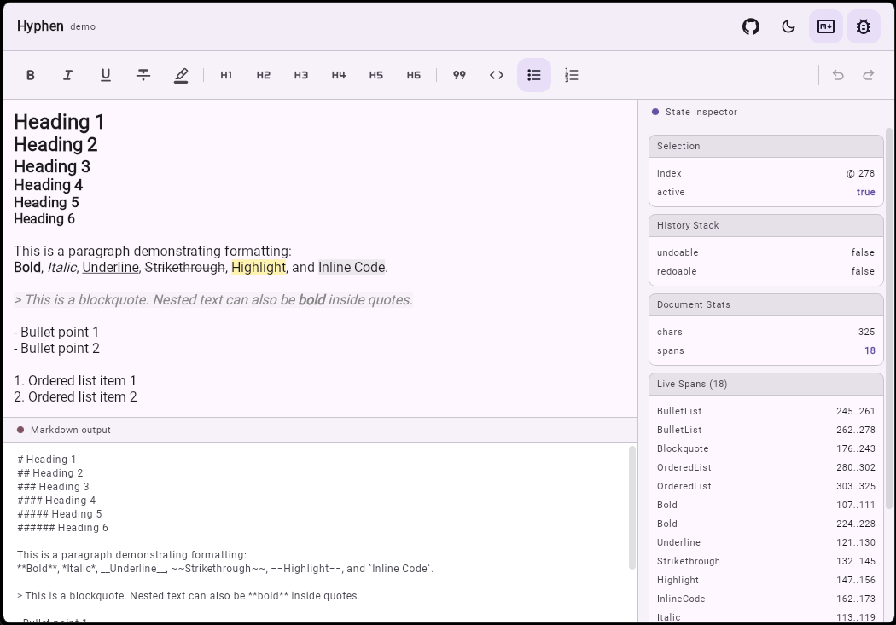

# Hyphen

<picture>
  <source srcset="assets/images/banner.jpg">
  
</picture>

<br>

<p align="center">
  A <strong>WYSIWYG Markdown editor</strong> for Compose Multiplatform.<br>
  Type in Markdown, see formatting live. Copy as Markdown. Works on Android, Desktop, and Web.
</p>

<p align="center">
  <a href="https://github.com/densermeerkat/hyphen/releases"></a>
  <a href="https://kotlinlang.org"></a>
  <a href="https://www.jetbrains.com/compose-multiplatform/"></a>
  
</p>

<p align="center">
  <a href="https://densermeerkat.github.io/hyphen/"><strong>→ Try the live web demo</strong></a>
</p>

<picture>
  <source media="(prefers-color-scheme: dark)" srcset="assets/images/demo_dark.png">
  <source media="(prefers-color-scheme: light)" srcset="assets/images/demo_light.png">
  
</picture>

## Features

### ✍️ Live Markdown Input

Type Markdown syntax directly and watch it convert as you write — no mode switching, no preview pane required.

| Syntax                  | Style             |
| ----------------------- | ----------------- |
| `**text**`              | **Bold**          |
| `*text*`                | _Italic_          |
| `__text__`              | Underline         |
| `` `text` ``            | `Inline code`     |
| `~~text~~`              | ~~Strikethrough~~ |
| `==text==`              | Highlight         |
| `# ` at line start      | Heading 1         |
| `## ` at line start     | Heading 2         |
| `### ` at line start    | Heading 3         |
| `#### ` at line start   | Heading 4         |
| `##### ` at line start  | Heading 5         |
| `###### ` at line start | Heading 6         |
| `- ` at line start      | Bullet list       |
| `1. ` at line start     | Ordered list      |
| `> ` at line start      | Blockquote        |

### 📋 Markdown Clipboard

Cut, copy, and paste all work across Android, Desktop, and Web. Copying a selection serializes it to Markdown automatically, paste into any Markdown-aware editor and all formatting travels with it.

### ⌨️ Keyboard Shortcuts

Full hardware keyboard support on Desktop and Web:

| Shortcut                 | Action                        |
| ------------------------ | ----------------------------- |
| `Ctrl / Cmd + B`         | Toggle bold                   |
| `Ctrl / Cmd + I`         | Toggle italic                 |
| `Ctrl / Cmd + U`         | Toggle underline              |
| `Ctrl / Cmd + Shift + S` | Toggle strikethrough          |
| `Ctrl / Cmd + Shift + X` | Toggle strikethrough          |
| `Ctrl / Cmd + Alt + X`   | Toggle strikethrough          |
| `Ctrl / Cmd + Shift + H` | Toggle highlight              |
| `Ctrl / Cmd + Space`     | Clear all styles on selection |
| `Ctrl / Cmd + 1`         | Toggle Heading 1              |
| `Ctrl / Cmd + 2`         | Toggle Heading 2              |
| `Ctrl / Cmd + 3`         | Toggle Heading 3              |
| `Ctrl / Cmd + 4`         | Toggle Heading 4              |
| `Ctrl / Cmd + 5`         | Toggle Heading 5              |
| `Ctrl / Cmd + 6`         | Toggle Heading 6              |
| `Ctrl / Cmd + Z`         | Undo                          |
| `Ctrl / Cmd + Y`         | Redo                          |
| `Ctrl / Cmd + Shift + Z` | Redo                          |

### ↩️ Undo / Redo History

Granular history with snapshots saved at word boundaries, pastes, and Markdown conversions. The redo stack is maintained correctly across all operations, including toolbar toggles and programmatic edits.

### 🌍 Compose Multiplatform

Single shared implementation targeting Android, Desktop (JVM), and Web (WasmJS / JS).

---

## Installation

### Using `libs.versions.toml` (recommended)

Add the version and library entry to your version catalog:

**`gradle/libs.versions.toml`**

```toml
[versions]
hyphen = "0.2.0-alpha01"

[libraries]
hyphen = { group = "io.github.densermeerkat", name = "hyphen", version.ref = "hyphen" }
```

Then reference it in your shared module:

**`shared/build.gradle.kts`**

```kotlin
kotlin {
    sourceSets {
        commonMain.dependencies {
            implementation(libs.hyphen)
        }
    }
}
```

> `commonMain` is the source set that compiles for every target at once — Android, Desktop, and Web. Declaring Hyphen there means you write the dependency once and all platforms pick it up automatically.

### Using string notation

```kotlin
// shared/build.gradle.kts
kotlin {
    sourceSets {
        commonMain.dependencies {
            implementation("io.github.densermeerkat:hyphen:0.2.0-alpha01")
        }
    }
}
```

## Quick Start

```kotlin
val state = rememberHyphenTextState(
    initialText = "**Hello**, *Hyphen*!"
)

HyphenBasicTextEditor(
    state = state,
    modifier = Modifier.fillMaxSize(),
)

// Read the result at any time
val markdown = state.toMarkdown()
```

---

## Choosing an Editor Component

Hyphen ships two editor composables. Use whichever fits your design:

### `HyphenBasicTextEditor`

A thin wrapper around `BasicTextField` with no decoration. Use this when you control the layout yourself or want full design freedom.

```kotlin
HyphenBasicTextEditor(
    state = state,
    modifier = Modifier
        .fillMaxWidth()
        .padding(16.dp),
    textStyle = TextStyle(
        fontSize = 16.sp,
        color = MaterialTheme.colorScheme.onSurface,
    ),
    cursorBrush = SolidColor(MaterialTheme.colorScheme.primary),
    onMarkdownChange = { markdown -> /* sync to ViewModel */ },
)
```

### `HyphenTextEditor` _(Material 3)_

Wraps `HyphenBasicTextEditor` inside a standard Material3 filled text field decorator — labels, placeholder, leading/trailing icons, supporting text, and error state all work out of the box.

```kotlin
HyphenTextEditor(
    state = state,
    label = { Text("Notes") },
    placeholder = { Text("Start typing…") },
    trailingIcon = { Icon(Icons.Default.Edit, contentDescription = null) },
    supportingText = { Text("Markdown supported") },
    modifier = Modifier.fillMaxWidth(),
)
```

Both composables accept the same `styleConfig`, `onTextChange`, `onMarkdownChange`, and `clipboardLabel` parameters. The Material3 variant additionally accepts `colors`, `shape`, `labelPosition`, `contentPadding`, and all standard decoration slots.

---

## Usage

### Toolbar buttons — keeping focus on Desktop & Web

On Desktop and Web, clicking a button moves keyboard focus away from the editor. This causes the text selection to be lost before the style toggle runs. Fix this by adding `focusProperties { canFocus = false }` to every toolbar button so focus never leaves the editor when a button is tapped:

```kotlin
IconToggleButton(
    checked = state.hasStyle(MarkupStyle.Bold),
    onCheckedChange = { state.toggleStyle(MarkupStyle.Bold) },
    modifier = Modifier.focusProperties { canFocus = false }, // ← required on Desktop & Web
) {
    Icon(Icons.Default.FormatBold, contentDescription = "Bold")
}
```

This applies to any clickable element in your toolbar — `IconButton`, `Button`, `IconToggleButton`, etc.

### Custom style config

```kotlin
HyphenBasicTextEditor(
    state = state,
    styleConfig = HyphenStyleConfig(
        boldStyle = SpanStyle(
            fontWeight = FontWeight.ExtraBold,
            color = Color(0xFF1A73E8),
        ),
        highlightStyle = SpanStyle(
            background = Color(0xFFFFF176),
        ),
        inlineCodeStyle = SpanStyle(
            background = Color(0xFFF1F3F4),
            fontFamily = FontFamily.Monospace,
            color = Color(0xFFD93025),
        ),
    ),
)
```

### Programmatic control

```kotlin
// Load new Markdown content (resets undo history)
state.setMarkdown("# New content\n\nHello!")

// Toggle formatting from a custom button
Button(onClick = { state.toggleStyle(MarkupStyle.Bold) }) { Text("B") }

// Remove all inline formatting from the current selection
Button(onClick = { state.clearAllStyles() }) { Text("Clear") }

// Undo / redo
state.undo()
state.redo()
```

### Reactive observation

```kotlin
// Callback — fires on every text or formatting change
HyphenBasicTextEditor(
    state = state,
    onMarkdownChange = { markdown -> viewModel.onContentChanged(markdown) },
)

// Flow — collect anywhere, debounce freely
viewModelScope.launch {
    state.markdownFlow
        .debounce(500)
        .collect { markdown -> repository.save(markdown) }
}
```

---

## API Reference

### `HyphenBasicTextEditor`

| Parameter           | Type                        | Default                   | Description                                                                                 |
| ------------------- | --------------------------- | ------------------------- | ------------------------------------------------------------------------------------------- |
| `state`             | `HyphenTextState`           | —                         | Required. Holds text, spans, selection, and history.                                        |
| `modifier`          | `Modifier`                  | `Modifier`                | Applied to the underlying `BasicTextField`.                                                 |
| `enabled`           | `Boolean`                   | `true`                    | When `false`, the field is neither editable nor focusable.                                  |
| `readOnly`          | `Boolean`                   | `false`                   | When `true`, the field cannot be edited but can be focused and copied from.                 |
| `textStyle`         | `TextStyle`                 | `16sp`                    | Typography applied to the visible text.                                                     |
| `styleConfig`       | `HyphenStyleConfig`         | `HyphenStyleConfig()`     | Visual appearance of each `MarkupStyle` — colors, weights, decorations.                     |
| `keyboardOptions`   | `KeyboardOptions`           | Sentences, no autocorrect | Software keyboard configuration.                                                            |
| `lineLimits`        | `TextFieldLineLimits`       | `Default`                 | Single-line or multi-line behaviour.                                                        |
| `scrollState`       | `ScrollState`               | `rememberScrollState()`   | Controls vertical or horizontal scroll of the field content.                                |
| `interactionSource` | `MutableInteractionSource?` | `null`                    | Hoist to observe focus, hover, and press interactions externally.                           |
| `cursorBrush`       | `Brush`                     | `SolidColor(Color.Black)` | Cursor color. Pass `SolidColor(Color.Unspecified)` to hide.                                 |
| `decorator`         | `TextFieldDecorator?`       | `null`                    | Wraps the field with labels, icons, or borders (e.g. a Material3 decorator).                |
| `onTextLayout`      | `(Density.(...) -> Unit)?`  | `null`                    | Invoked on every text layout recalculation. Useful for cursor drawing or hit testing.       |
| `clipboardLabel`    | `String`                    | `"Markdown Text"`         | Label attached to the clipboard entry when text is copied.                                  |
| `onTextChange`      | `((String) -> Unit)?`       | `null`                    | Invoked whenever the plain undecorated text changes.                                        |
| `onMarkdownChange`  | `((String) -> Unit)?`       | `null`                    | Invoked whenever text or formatting changes, providing the full serialized Markdown string. |

### `HyphenTextState`

| Member                     | Description                                                         |
| -------------------------- | ------------------------------------------------------------------- |
| `text`                     | Plain text with all Markdown syntax stripped                        |
| `selection`                | Current cursor position or selected range (`TextRange`)             |
| `spans`                    | Snapshot-observable list of active `MarkupStyleRange` entries       |
| `pendingOverrides`         | Transient style intent applied to the next typed characters         |
| `canUndo` / `canRedo`      | Undo / redo availability                                            |
| `isFocused`                | Whether the field currently has input focus                         |
| `toggleStyle(style)`       | Toggle an inline or block style on the current selection            |
| `clearAllStyles()`         | Remove all inline formatting from the selection; suppress at cursor |
| `hasStyle(style)`          | `true` if the style is active at the current selection or cursor    |
| `isStyleAt(index, style)`  | Point query against the span list (ignores selection / overrides)   |
| `clearPendingOverrides()`  | Reset transient typing intent                                       |
| `undo()` / `redo()`        | Navigate undo / redo history                                        |
| `toMarkdown(start?, end?)` | Serialize content (or a range) to a Markdown string                 |
| `setMarkdown(markdown)`    | Replace all content programmatically and reset history              |
| `markdownFlow`             | `Flow<String>` emitting on every text or formatting change          |

### `HyphenStyleConfig`

| Property              | Default                            |
| --------------------- | ---------------------------------- |
| `boldStyle`           | `FontWeight.Bold`                  |
| `italicStyle`         | `FontStyle.Italic`                 |
| `underlineStyle`      | `TextDecoration.Underline`         |
| `strikethroughStyle`  | `TextDecoration.LineThrough`       |
| `highlightStyle`      | Semi-transparent yellow background |
| `inlineCodeStyle`     | Monospace, light grey background   |
| `blockquoteSpanStyle` | Italic, grey, faint background     |
| `h1Style`             | `24.sp`, `FontWeight.Bold`         |
| `h2Style`             | `22.sp`, `FontWeight.Bold`         |
| `h3Style`             | `20.sp`, `FontWeight.Bold`         |
| `h4Style`             | `18.sp`, `FontWeight.Bold`         |
| `h5Style`             | `17.sp`, `FontWeight.Bold`         |
| `h6Style`             | `16.sp`, `FontWeight.Bold`         |

### `MarkupStyle`

```kotlin
// Inline styles
MarkupStyle.Bold
MarkupStyle.Italic
MarkupStyle.Underline
MarkupStyle.Strikethrough
MarkupStyle.InlineCode
MarkupStyle.Highlight

// Heading styles
MarkupStyle.H1
MarkupStyle.H2
MarkupStyle.H3
MarkupStyle.H4
MarkupStyle.H5
MarkupStyle.H6

// Block styles
MarkupStyle.BulletList
MarkupStyle.OrderedList
MarkupStyle.Blockquote
```

---

## Supported Platforms

| Platform      | Status     |
| ------------- | ---------- |
| Android       | ✅         |
| Desktop (JVM) | ✅         |
| Web (WasmJS)  | ✅         |
| Web (JS / IR) | ✅         |
| iOS           | 🚧 Planned |
